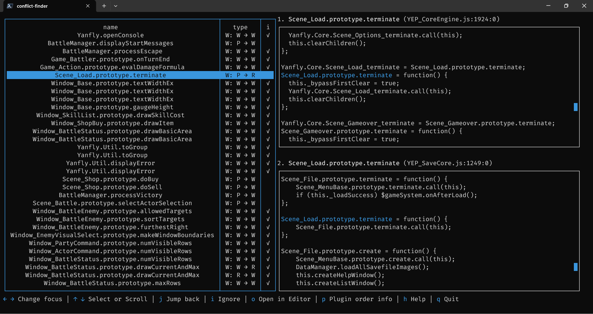

## Install
Download source code from github and go to project directory run this command:
```shell
npm install
```
Or install by npm directly:
```shell
npm install https://github.com/moonyoulove/rpgmaker-plugin-conflict-finder.git --global
```
Or download single executable app from [release page](https://github.com/moonyoulove/rpgmaker-plugin-conflict-finder/releases/latest).

## Config
Go to project directory, rename *.env.example* to *.env* and fill it on demand.

If using executable binary, put *.env* in the same directory.
```shell
EDITOR=
COLOR=
```
`EDITOR` used to open the conflict plugin in a text editor. Value can be sublime, atom, vscode, vscodium etc. Details can be found [here](https://github.com/sindresorhus/open-editor#open-editor), but the editor must be set in environment variables to work.

`COLOR` used to customize the main color of the interface, which can be a color name or hex. For details, see [here]( https://github.com/chjj/blessed?tab=readme-ov-file#colors-1).

## Usage
Use this command in project directory:
```
node ./cli.js [options]
```
Or use use this command in anywhere(when installing globally):
```
rpgmaker-plugin-conflict-finder [options]
```
Or use single executable app:
```
./conflict-finder [options]
```
* On Windows:
  ```
  .\conflict-finder.exe [options] 
  ```
  You can also double-click to open.

## Options
```
Options:
  --project <path>  rpg maker mv/mz project path
  --no-unicode      disable full unicode support for CJK to avoid lag when data is large
  --theme <color>   theme color support color name or hex (default: "cyan")
  --editor <name>   text editor to open conflict plugins
  -h, --help        display help for command
```

## Programming
```js
import { ConflictOutput, findConflict, getOrder } from "rpgmaker-plugin-conflict-finder";
const options = {
    projectPath: "path/to/project",
    fullUnicode: true, // default: true
    themeColor: "#ffffff", // default: cyan
    textEditor: "vscode"
};
const conflicts = findConflict(options.projectPath);
const output = new ConflictOutput(conflicts, options.projectPath, options.fullUnicode, options.themeColor, options.textEditor);
output.show();
```

## TODO